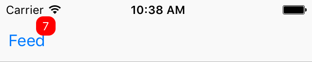

# EasyNotificationBadge
UIView extension that adds a notification badge.

The code that was used in this extension was originally written by [mustafaibrahim989](https://github.com/mustafaibrahim989) in the library [MIBadgeButton-Swift](https://github.com/mustafaibrahim989/MIBadgeButton-Swift).

##Screenshots


 




##Installation

Simply drag and drop ```NSBadge.swift``` to your project.

##Usage

To add a badge with default settings use this:
```swift
view.badge(text: "5")
```
```swift
barButtonItem.badge(text: "7")
```

To remove the badge:

```swift
view.badge(text: nil)
```

```swift
barButtonItem.badge(text: nil)
```

##Advanced Usage

```swift
let badgeAppearnce = BadgeAppearnce()
appearnce.backgroundColor = UIColor.blue //default is red
appearnce.textColor = UIColor.white // default is white
appearnce.alignment = .center //default is center
appearnce.textSize = 15 //default is 12
view.badge(text: "Your text",badgeEdgeInsets: UIEdgeInsetsMake(20, 0, 0, 15),appearnce: badgeAppearnce)
```
