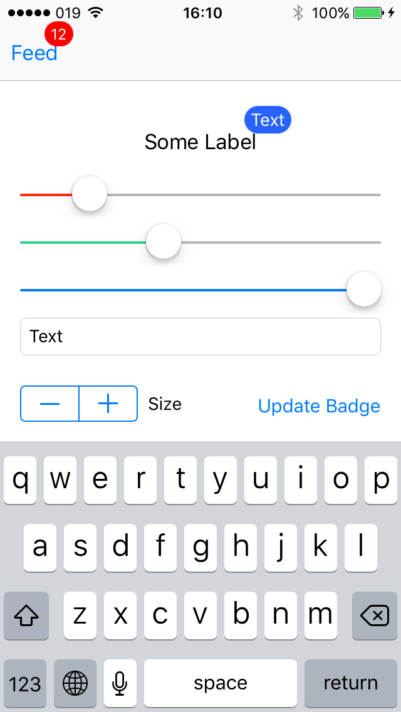

# EasyNotificationBadge
UIView extension that adds a notification badge.

The code that was used in this extension was originally written by [mustafaibrahim989](https://github.com/mustafaibrahim989) in the library [MIBadgeButton-Swift](https://github.com/mustafaibrahim989/MIBadgeButton-Swift).

## Screenshots


## Installation


```bash
pod 'EasyNotificationBadge'
```

Or simply drag and drop ```NSBadge.swift``` to your project.

## Usage

To add a badge with default settings use this (This also applies to updating an existing badge):
```swift
view.badge(text: "5")
```
```swift
barButtonItem.badge(text: "7")
```

To remove the badge:

```swift
view.badge(text: nil)
```

```swift
barButtonItem.badge(text: nil)
```

## Advanced Usage

```swift
let badgeAppearnce = BadgeAppearnce()
badgeAppearnce.backgroundColor = UIColor.blue //default is red
badgeAppearnce.textColor = UIColor.white // default is white
badgeAppearnce.alignment = .center //default is center
badgeAppearnce.textSize = 15 //default is 12
badgeAppearnce.distenceFromCenterX = 15 //default is 0
badgeAppearnce.distenceFromCenterY = -10 //default is 0
badgeAppearnce.allowShadow = true
badgeAppearnce.borderColor = .blue
badgeAppearnce.borderWidth = 1
view.badge(text: "Your text", appearnce: badgeAppearnce)
```

### Important
When calling `.badge` make sure that the view has already been loaded and has a superview. Setting a badge on a view that hasn't fully loaded can lead to unexpected results.
